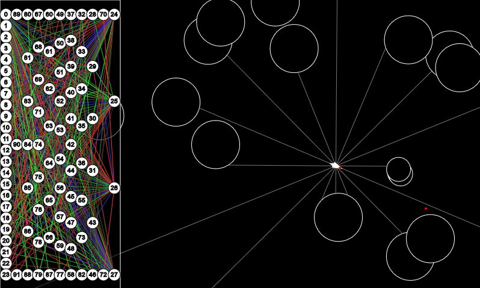

# Asteroids

Inspired by [Coding Train](https://github.com/CodingTrain/Asteroids) and [Code Bullet](https://github.com/Code-Bullet/Asteroids-with-NEAT), here is my take on the Asteroids game with an AI trained using Neuroevolution through Augmenting Topologies (NEAT), given vision using ray casting.

You can watch a neural network learn to play the game in your very own browser by following [this link](https://immodal.github.io/asteroids/).
 

  

Figure 1: AI playing the game

  

Figure 2: Showing neural network and ray casting

